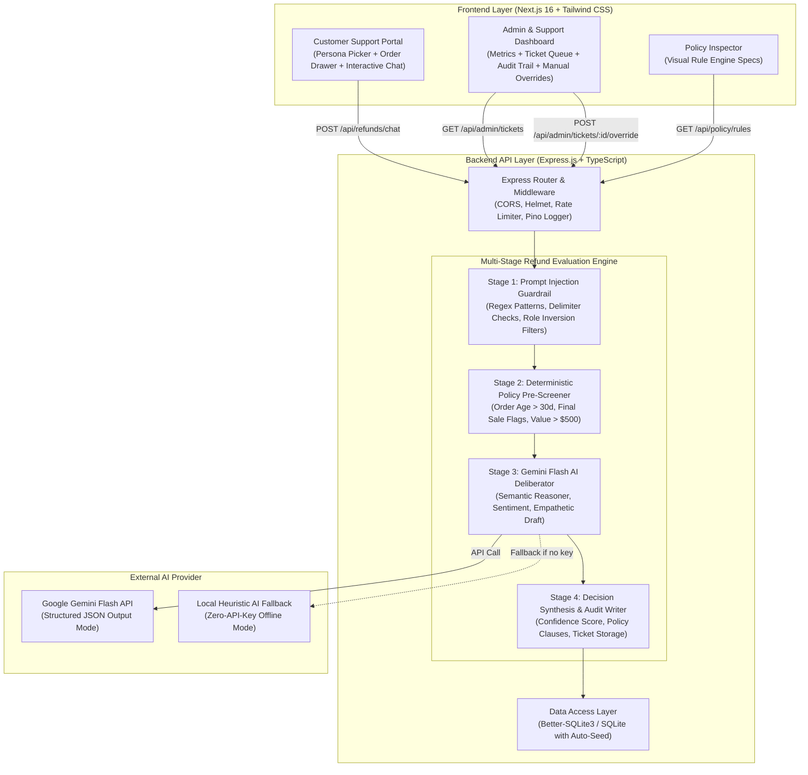
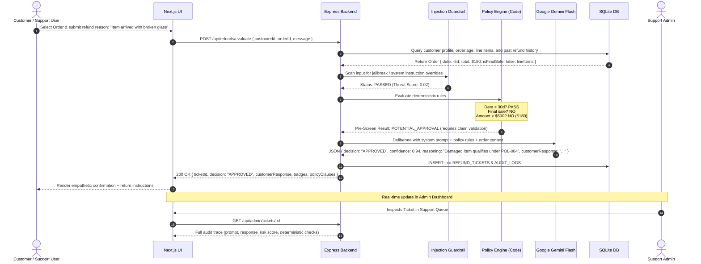

# RevRescue: Architecture & System Design

RevRescue is an AI-powered customer support refund evaluation system built with a modular, layered full-stack architecture.

---

## 1. High-Level Architecture Diagram



---

## 2. Request Lifecycle Sequence Diagram



---

## 3. Core API Endpoints

### Customer & Order Endpoints
- `GET /api/customers` - Returns all 15 synthetic customer personas with loyalty tier and past refund stats.
- `GET /api/customers/:id` - Returns individual customer details and full order history.
- `GET /api/orders/:id` - Returns order items, dates, final sale tags, and tracking status.

### Refund & Chat Endpoints
- `POST /api/refunds/chat` - Interactive chat endpoint supporting continuous conversational turns with AI support agent.
- `POST /api/refunds/evaluate` - Single-step submission returning structured evaluation (`decision`: `APPROVED` | `DENIED` | `ESCALATED`, reasoning, customer response, risk score, rule hits).
- `GET /api/policy/rules` - Returns list of active business rules.

### Admin & Support Endpoints
- `GET /api/admin/metrics` - High-level metrics: Total requests, Approval rate, Escalations in queue, Total refund value, Average processing time.
- `GET /api/admin/tickets` - List of all refund tickets with filter by status (`APPROVED`, `DENIED`, `ESCALATED`, `OVERRIDDEN`) and risk level.
- `GET /api/admin/tickets/:id` - Full audit inspection view (conversation transcript, prompt injection scan result, raw LLM reasoning, code pre-screener result).
- `POST /api/admin/tickets/:id/override` - Human-in-the-loop action: Supervisor overrides decision (`APPROVED`, `DENIED`, `ESCALATED`) with mandatory audit notes.

---

## 4. Containerization Strategy

The repository includes a top-level `docker-compose.yml` linking:
1. **`revrescue-backend`**:
   - Node 20 LTS Alpine image
   - Compiles TypeScript and runs Express API on port `5000`
   - SQLite database volume mounted for instant zero-dependency data persistence
   - Pre-seeds 15 customer profiles on initial launch
2. **`revrescue-frontend`**:
   - Next.js 16 container running on port `3000`
   - Proxies API requests to `http://revrescue-backend:5000`
   - Built-in hot-reloading for local development

Single command bootstrap:
```bash
docker-compose up --build
```
Everything spins up in under 60 seconds with no external database dependencies required.
