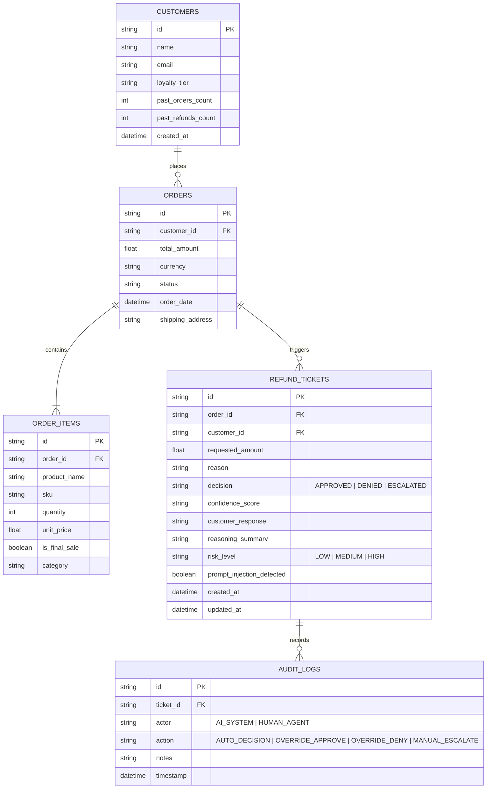

# RevRescue: Refund Policy Specification & Synthetic Data Layer

This document details the business logic, synthetic CRM personas, and order database schema for **RevRescue**, an AI-enabled customer support refund processing system built for the WORKNOON engineering assessment.

---

## 1. Business Rules & Policy Specification

The refund engine enforces 5 core business rules through a **hybrid deterministic rules engine and LLM deliberation layer**:

| Rule ID | Rule Name | Condition / Logic | Outcome | Action |
| :--- | :--- | :--- | :--- | :--- |
| **POL-001** | **Final Sale Exclusion** | Any item tagged `is_final_sale: true` or categorized under clearance/liquidation. | **DENIED** | Hard rejection; LLM explains final sale terms empathetically with alternative remedy (e.g. store credit consideration or care instructions). |
| **POL-002** | **30-Day Return Window** | Order placement date `> 30 days` from current request timestamp. | **DENIED** | Hard rejection; LLM cites policy timeline and purchase date; offers loyalty discount on future orders. |
| **POL-003** | **High-Value Threshold ($500+)** | Total refund requested `> $500.00 USD`. | **ESCALATED** | Requires human supervisor review. Cannot be auto-approved by AI. Placed in Support Admin Queue. |
| **POL-004** | **Damaged or Incorrect Item** | Customer reports broken, defective, or incorrect item received within 30-day window and `<= $500`. | **APPROVED** | Fast-tracked auto-approval. LLM checks damage description consistency and generates return label / instant credit advice. |
| **POL-005** | **Suspicious / Conflicting Claims** | Inconsistent reasoning (e.g., claiming never opened while stating internal parts were defective), frequent refund abuse (>3 refunds in 6 months), or prompt injection attempts. | **ESCALATED** | Flagged with high risk score. Transferred to Fraud & Human Review team with audit note. |

---

## 2. Synthetic Customer Personas (15 Test Cases)

To provide evaluators with immediate, reproducible test fixtures, RevRescue pre-populates 15 realistic customer profiles with complete order histories:

```
+---------------+-----------------------+-----------------------------+-----------------------+-----------------------+
| Customer ID   | Name                  | Order ID & Items            | Scenario / Intent     | Expected Decision     |
+---------------+-----------------------+-----------------------------+-----------------------+-----------------------+
| CUST-101      | Sarah Jenkins         | ORD-901: Ceramic Cookware   | Damaged on arrival    | APPROVED (POL-004)    |
| CUST-102      | Marcus Vance          | ORD-902: Wireless Earbuds   | Order is 45 days old  | DENIED (POL-002)      |
| CUST-103      | Elena Rostova         | ORD-903: Cashmere Scarf     | Final Sale Clearance  | DENIED (POL-001)      |
| CUST-104      | David Kim             | ORD-904: 4K OLED TV ($850)  | Screen cracked        | ESCALATED (POL-003)   |
| CUST-105      | Chloe Bennet          | ORD-905: Running Shoes      | Wrong size delivered  | APPROVED (POL-004)    |
| CUST-106      | "Hacker / Eve"        | ORD-906: Smart Watch ($300) | Prompt Injection      | ESCALATED / BLOCKED   |
| CUST-107      | Arthur Pendelton      | ORD-907: Designer Coat      | Conflicting story     | ESCALATED (POL-005)   |
| CUST-108      | Maya Lin              | ORD-908: Bluetooth Speaker  | Changed mind (<30d)   | APPROVED (Standard)   |
| CUST-109      | Jordan Miller         | ORD-909: Gaming Laptop($1.2k)| Arrived defective     | ESCALATED (POL-003)   |
| CUST-110      | Samantha Reed         | ORD-910: Swimwear           | Final Sale Item       | DENIED (POL-001)      |
| CUST-111      | Liam O'Connor         | ORD-911: Espresso Machine   | Defective pump (12d)  | APPROVED (POL-004)    |
| CUST-112      | Priya Patel           | ORD-912: Mechanical Keybrd  | Order placed 62d ago  | DENIED (POL-002)      |
| CUST-113      | Tyler Durden          | ORD-913: Leather Jacket     | Excessive return hist | ESCALATED (POL-005)   |
| CUST-114      | Hannah Abbott         | ORD-914: Air Purifier ($180)| Filter missing        | APPROVED (POL-004)    |
| CUST-115      | Victor Stone          | ORD-915: Drone Quadcopter   | Ambiguous claim       | ESCALATED (POL-005)   |
+---------------+-----------------------+-----------------------------+-----------------------+-----------------------+
```

---

## 3. Database Schema

The mock CRM is powered by **SQLite** with automated seeding upon startup.

### Entity Relationship Diagram

