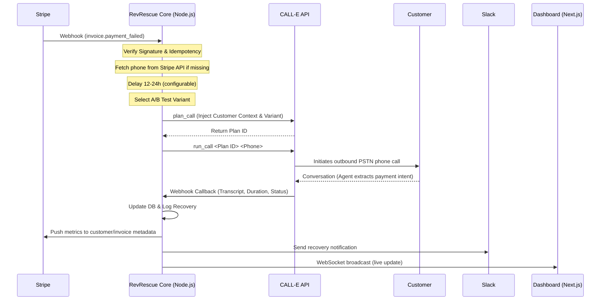

# Product Overview & Core Flow

## Executive Summary
RevRescue is an autonomous, programmatic voice concierge that intercepts high-ticket B2B SaaS churn at the exact moment of failure. By fusing Stripe billing events with the CALL-E voice AI platform, RevRescue replaces easily ignored dunning emails with high-empathy, automated voice interventions.

> [!NOTE]
> This document is the high-level primer for the RevRescue platform. For detailed API docs, see `05-internal-apis.md`.

---

## 1. The Domain Problem: Silent Churn
B2B SaaS companies lose **5-10%** of their Monthly Recurring Revenue (MRR) to "silent churn" — involuntary churn caused by failed credit cards. When a payment fails, billing systems like Stripe trigger automated "Dunning" emails. However, humans are biologically wired to ignore automated emails. The digital friction required to update a card is often too high, leading to unnecessarily lost revenue.

## 2. The Solution: Analog Reciprocity
RevRescue bridges the digital-to-analog gap by deploying an AI "Customer Success Agent" that calls high-value clients immediately after a churn risk event. It leverages the psychological principle of *reciprocity*, making it incredibly difficult to ignore a polite, empathetic human-sounding voice on the phone compared to a templated, lifeless email.

## 3. Key Features

| Feature | Description |
|---------|-------------|
| **A/B Testing** | Pit two voice personas against each other to scientifically prove which prompt recovers more MRR |
| **Slack Alerts** | Real-time notifications when accounts are saved or lost |
| **CSV Exports** | Finance teams can instantly export recovery logs to calculate ROI |
| **Delayed Execution** | payment_failed calls delayed 12-24h to let Stripe Smart Retries work first |
| **Automatic Phone Lookup** | Fetches missing phone numbers from Stripe API |
| **Retry Queue** | Failed calls retry automatically (3 attempts) |
| **Real-time Dashboard** | WebSocket-powered live updates |
| **API Key Management** | Programmatic access for integrations |
| **OpenAPI Docs** | Interactive Swagger UI at `/api/docs` |

## 4. Core Architecture Flow

### Flow Breakdown
1. **Trigger Event:** A payment fails (`invoice.payment_failed`) or subscription is canceled (`customer.subscription.deleted`) in Stripe.
2. **Webhook Interception:** RevRescue verifies the cryptographic signature and checks idempotency.
3. **Smart Delay:** payment_failed events are delayed 12-24 hours to let Stripe Smart Retries work first.
4. **Phone Lookup:** If the invoice lacks a phone number, fetches it from the Stripe Customer API.
5. **A/B Test Selection:** System randomly selects one of the user's active "Playbook" prompts.
6. **Agent Execution:** CALL-E initiates the outbound phone call over PSTN.
7. **Data Extraction & Alerting:** Transcript is parsed, Neon DB updated, Slack alert fired, metrics pushed to Stripe.
8. **Real-time Update:** WebSocket broadcasts the result to all connected dashboard clients.

## 5. API Structure

| Base Path | Purpose |
|-----------|---------|
| `/auth` | JWT authentication (login, refresh) |
| `/api/v1/metrics` | Dashboard KPIs |
| `/api/v1/logs` | Recovery logs (paginated, filterable) |
| `/api/v1/playbooks` | Voice prompt management |
| `/api/v1/analytics` | A/B test analytics |
| `/api/v1/exports` | CSV/JSON data exports |
| `/api/v1/api-keys` | API key management |
| `/api/webhooks/stripe` | Stripe event receiver |
| `/api/webhooks/calle` | CALL-E callback receiver |
| `/api/docs` | Swagger UI |
| `/health` | Health check with DB ping |
| `ws://.../ws/dashboard` | WebSocket real-time updates |

Full API documentation: `docs/05-internal-apis.md`
