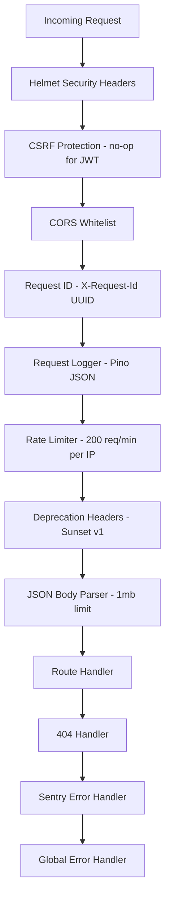
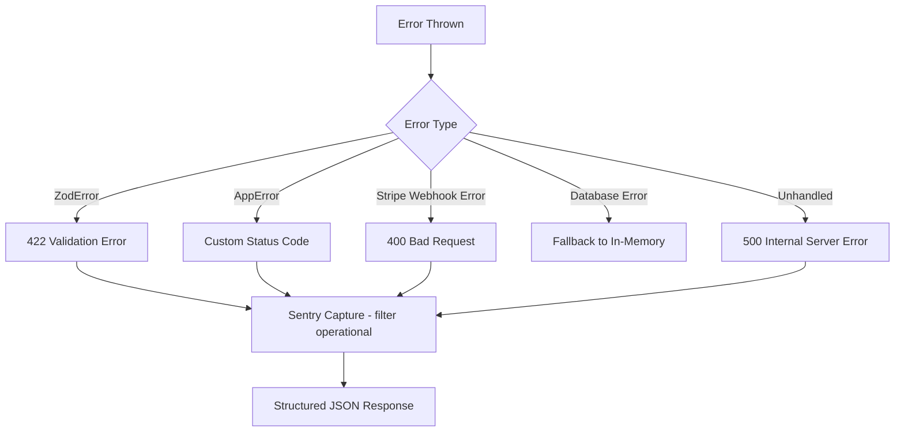

# Backend Architecture

## Executive Summary
The RevRescue Backend is a high-performance, asynchronous **Node.js/Express** service acting as the orchestration layer between Stripe, CALL-E, and the Next.js frontend. It is engineered for extreme resilience, featuring a graceful database fallback pattern, structured logging, error tracking, and security hardening.

> [!IMPORTANT]
> The backend operates on an asynchronous, event-driven model. Stripe webhooks must return a `200 OK` immediately upon receipt. Heavy processing (like LLM context generation and API calls) is handled asynchronously via setTimeout and retry queues.

---

## 1. Core Tech Stack
| Component | Technology |
|-----------|-----------|
| Runtime | Node.js |
| Framework | Express.js |
| Language | TypeScript (strict mode, executed via `tsx`) |
| Database | Neon (Serverless PostgreSQL) |
| DB Client | `pg` (Node Postgres) — singleton connection pool |
| Validation | Zod (request/response schemas) |
| Auth | JWT (jsonwebtoken) |
| Logging | Pino (structured JSON in production) |
| Error Tracking | Sentry |
| Security | Helmet, CORS whitelist, rate limiting |
| Real-time | Socket.IO (WebSocket) |
| API Docs | Swagger/OpenAPI (swagger-jsdoc + swagger-ui-express) |
| Unique IDs | uuid v4 |

## 2. System Design & Data Flow

```mermaid
graph TD
    A((Stripe Webhooks)) -->|POST /api/webhooks/stripe| B[Express Router]
    B -->|Verify Cryptographic Signature| C{Event Type Router}
    
    C -->|invoice.payment_failed| D[Delay 12-24h]
    C -->|customer.subscription.deleted| E[Immediate Execution]
    
    D --> F[A/B Test Variant Selection]
    E --> F
    
    F --> G[CALL-E Service Layer]
    G -->|CLI or REST API| H((CALL-E Platform))
    
    G --> I[RecoveryStore Abstraction]
    I -->|Try Insert| J[(Neon PostgreSQL)]
    I -.->|Catch Connection Error| K[(In-Memory Fallback)]
    
    G --> L[Slack Notification]
    G --> M[WebSocket Broadcast]
    G --> N[Stripe Metrics Export]
    
    H -->|Webhook Callback| O[/api/webhooks/calle]
    O --> I
    O --> L
```

## 3. Middleware Stack (Execution Order)



## 4. Directory Structure

```
backend/
├── src/
│   ├── config/
│   │   ├── index.ts          # Env vars, validation, config object
│   │   ├── swagger.ts        # OpenAPI/Swagger spec generator
│   │   └── sentry.ts         # Sentry error tracking init
│   ├── controllers/
│   │   ├── apiController.ts  # Metrics, logs, prompts, simulator
│   │   ├── playbookController.ts  # Playbook CRUD
│   │   └── webhookController.ts   # Stripe + CALL-E webhooks
│   ├── db/
│   │   ├── pool.ts           # Singleton Neon connection pool
│   │   └── schema.sql        # Database schema
│   ├── middleware/
│   │   ├── auth.ts           # JWT requireAuth/optionalAuth
│   │   ├── apiKeyAuth.ts     # X-API-Key header validation
│   │   ├── csrf.ts           # CSRF protection (no-op for API)
│   │   ├── deprecation.ts    # Sunset + Deprecation headers
│   │   ├── errorHandler.ts   # Not-found + global error handler
│   │   ├── idempotency.ts    # Idempotency-Key header support
│   │   ├── logger.ts         # Pino structured JSON logging
│   │   ├── rateLimiter.ts    # Sliding window rate limiter
│   │   ├── requestId.ts      # X-Request-Id UUID generation
│   │   └── requestLogger.ts  # Request/response logging
│   ├── routes/
│   │   ├── api.ts            # Metrics, logs, prompts, simulator
│   │   ├── analytics.ts      # A/B test analytics
│   │   ├── apiKeys.ts        # API key management
│   │   ├── auth.ts           # Login, refresh tokens
│   │   ├── exports.ts        # CSV, JSON, summary exports
│   │   ├── playbooks.ts      # Playbook CRUD
│   │   └── webhooks.ts       # Stripe + CALL-E webhooks
│   ├── services/
│   │   ├── analyticsService.ts   # A/B variant tracking
│   │   ├── calleRestApi.ts       # CALL-E REST client (Phase 1)
│   │   ├── calleService.ts       # CALL-E CLI integration
│   │   ├── exportService.ts      # CSV/JSON export
│   │   ├── apiKeyService.ts      # API key CRUD
│   │   ├── playbookService.ts    # Playbook CRUD + selection
│   │   ├── promptBuilder.ts      # Dynamic prompt generation
│   │   ├── recoveryStore.ts      # DB abstraction layer
│   │   ├── retryQueue.ts         # Failed call retry queue
│   │   ├── slackService.ts       # Slack notifications
│   │   ├── smsService.ts         # SMS delivery
│   │   ├── stripeMetrics.ts      # Stripe metadata export
│   │   └── websocketService.ts   # Socket.IO dashboard updates
│   ├── utils/
│   │   └── pagination.ts     # Shared pagination + sort helpers
│   ├── validators/
│   │   ├── api.schema.ts     # Zod schemas for API requests
│   │   ├── middleware.ts      # validateBody, validateQuery, validateParams
│   │   └── query.schema.ts   # Log query params schema
│   └── server.ts             # App bootstrap, middleware, routes
├── tests/
│   ├── api.test.ts           # API endpoint tests
│   ├── slack.test.ts         # Slack notification tests
│   └── webhook.test.ts       # Stripe webhook tests
├── scripts/
│   └── validate-schema.ts    # DB schema validation
├── package.json
├── tsconfig.json
└── jest.config.js
```

## 5. RecoveryStore Fallback Pattern
To guarantee high availability — especially during the MVP phase or when the Neon database spins down to zero — the `RecoveryStore` utilizes a graceful degradation pattern:

1. **Attempt Database Write/Read:** The system tries to execute standard `pg` queries via the singleton connection pool.
2. **Catch Connection Errors:** If `pg` throws an error (e.g., timeout, invalid credentials, database paused).
3. **Fallback Execution:** The system logs a critical warning and silently falls back to an in-memory `LogRecord[]` array.

> [!WARNING]
> While the in-memory fallback prevents 500 errors and keeps webhooks ingesting, data stored in memory will be lost on server restart. Production deployments must ensure Neon database persistent connections and robust connection pooling.

## 6. Connection Pool Singleton
The backend uses a **singleton connection pool** (`db/pool.ts`) to prevent connection exhaustion:

| Setting | Value |
|---------|-------|
| Max connections | 10 |
| Idle timeout | 30 seconds |
| Connection timeout | 5 seconds |
| Statement timeout | 30 seconds |

The pool is created once at startup and shared across all services. A `pingDatabase()` health check verifies connectivity, and `getPoolStats()` returns connection metrics for monitoring.

## 7. Security Layers

| Layer | Implementation |
|-------|---------------|
| **HTTPS** | Enforced via deployment (Vercel/Railway) |
| **JWT Auth** | `POST /auth/login` → Bearer token → `requireAuth` middleware |
| **API Keys** | `X-API-Key` header → `apiKeyAuth` middleware |
| **CORS** | Whitelist via `CORS_ORIGINS` env var |
| **Rate Limiting** | 200 req/min per IP, sliding window |
| **Helmet** | CSP, X-Frame-Options, HSTS, XSS protection |
| **Body Size** | 1MB limit on JSON and URL-encoded payloads |
| **Input Validation** | Zod schemas on all endpoints |
| **SQL Injection** | Parameterized queries via `pg` |
| **Webhook Signatures** | Stripe cryptographic verification |

## 8. Error Handling



The global error handler returns a consistent format:
```json
{
  "success": false,
  "message": "Human-readable error",
  "errors": { "field": ["Specific error message"] }
}
```

## 9. Logging & Observability

| Feature | Implementation |
|---------|---------------|
| **Structured Logging** | Pino JSON in production, pretty in dev, silent in test |
| **Request ID** | `X-Request-Id` UUID header on every request |
| **Request Logging** | Method, URL, status, latency, request ID |
| **Error Tracking** | Sentry with `beforeSend` filtering operational errors |
| **Health Check** | `GET /health` → DB ping + pool stats + uptime |

## 10. Graceful Shutdown
The server handles `SIGTERM` and `SIGINT` signals:
1. Closes the Neon connection pool
2. Closes the HTTP server (drains in-flight requests)
3. Force exits after 10 seconds if still running
