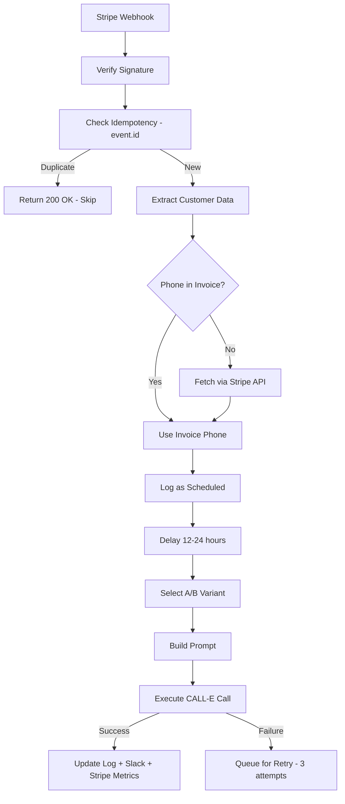

# Stripe Webhook Integration

## Executive Summary
RevRescue relies entirely on real-time billing events to trigger voice recovery campaigns. Stripe Webhooks are the primary mechanism for receiving these events. This document covers security, processing logic, idempotency, delayed execution, and metrics export.

> [!WARNING]
> Webhook endpoints are publicly accessible by definition. You must enforce Stripe Signature Verification on every incoming request.

---

## 1. Webhook Configuration

Point Stripe's webhook endpoint to:
```
https://<revrescue-domain>/api/webhooks/stripe
```

### Required Events
| Event | Action |
|-------|--------|
| `invoice.payment_failed` | Triggers Involuntary Churn workflow (delayed) |
| `customer.subscription.deleted` | Triggers Voluntary Churn workflow (immediate) |

### Required Environment Secrets
| Variable | Purpose |
|----------|---------|
| `STRIPE_SECRET_KEY` | Fetch customer details (phone) via Stripe API |
| `STRIPE_WEBHOOK_SECRET` | Cryptographic signature verification |

---

## 2. Security: Signature Verification

The Express route uses `express.raw()` body parsing to preserve the raw buffer for signature verification. JSON parsing would corrupt the stream and fail the check.

```typescript
app.post('/api/webhooks/stripe', 
  express.raw({ type: 'application/json', limit: '1mb' }), 
  handleStripeWebhook
);
```

Verification flow:
1. Extract `stripe-signature` header
2. Use `stripe.webhooks.constructEvent(rawBody, sig, secret)` 
3. If invalid → return `400 Bad Request`
4. If valid → process event

---

## 3. Event Processing

### `invoice.payment_failed` — Involuntary Churn



**Key behaviors:**
1. **Delay:** Calls are delayed by `PAYMENT_FAILED_DELAY_HOURS` (default: 12h) to let Stripe Smart Retries work first
2. **Phone fetch:** If invoice lacks phone number, fetches via `stripe.customers.retrieve()`
3. **Retry queue:** Failed calls retry at 30s, 2min, 5min intervals (3 attempts max)

### `customer.subscription.deleted` — Voluntary Churn

**Key behaviors:**
1. **Immediate execution** — customer is already gone, speed matters
2. No delay — exit interviews must happen while context is fresh
3. Same retry queue applies if call fails

---

## 4. Idempotency Guarantee

Stripe guarantees "at least once" delivery. RevRescue ensures strict idempotency:

1. Extract unique `event.id` from payload
2. Query `recovery_logs` table for existing `stripe_event_id`
3. If found → return `200 OK` immediately, skip processing
4. If not found → process and store `event.id` with the log record

This guarantees a customer is **never called twice** for the same billing failure.

---

## 5. Retry Queue for Failed Calls

When a CALL-E call fails, it's added to an in-memory retry queue:

| Attempt | Delay | Max Retries |
|---------|-------|-------------|
| 1st retry | 30 seconds | 3 |
| 2nd retry | 2 minutes | 3 |
| 3rd retry | 5 minutes | 3 |

After 3 failed attempts, the call is marked as `failed` and a Slack alert is sent.

---

## 6. Metrics Export to Stripe

After a successful recovery, RevRescue pushes metrics back to Stripe as metadata:

**On the Stripe Customer object:**
```json
{
  "metadata": {
    "revrescue_total_calls": "5",
    "revrescue_recovered": "3",
    "revrescue_last_call": "2026-08-03T10:00:00Z"
  }
}
```

**On the Stripe Invoice object:**
```json
{
  "metadata": {
    "revrescue_call_id": "run_abc123",
    "revrescue_outcome": "recovered",
    "revrescue_variant": "variant_a"
  }
}
```

This allows finance teams to see recovery data directly in Stripe.

---

## 7. Slack Notifications

When a call completes, a Slack notification is sent:

| Outcome | Notification |
|---------|-------------|
| `recovered` | ✅ "Successfully recovered $500 MRR from Acme Corp" |
| `failed` | ❌ "Failed to recover $500 MRR from Acme Corp" |
| `no_answer` | 📞 "No answer from Acme Corp (+1234567890)" |

Configure via `SLACK_WEBHOOK_URL` environment variable.

---

## 8. CALL-E Webhook Callback

### `POST /api/webhooks/calle`

CALL-E sends call results back to RevRescue in real-time:

**Request body:**
```json
{
  "call_id": "run_abc123",
  "status": "COMPLETED",
  "message": "Call completed successfully",
  "summary": "Customer agreed to update payment method",
  "transcript": "Agent: Hello... Customer: Yes, please send the link...",
  "outcome": null,
  "activity": []
}
```

**Processing:**
1. Update `recovery_logs` with transcript and outcome
2. Update metrics in database
3. Send Slack notification
4. Push metrics to Stripe metadata
5. Broadcast via WebSocket to connected dashboards
