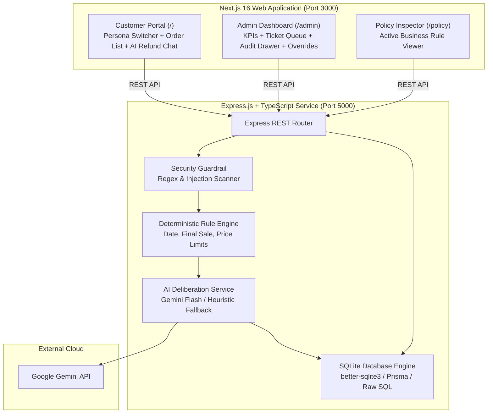

# System Design Spec: AI-Powered Customer Support Refund System (RevRescue)

**Date**: 2026-09-26  
**Status**: Pending Review  
**Target Submission**: WORKNOON Full Stack Engineer Take-Home Assessment  

---

## 1. Executive Summary

RevRescue is an AI-powered customer support refund evaluation system. It allows customers to interact with an AI support agent to request refunds for e-commerce orders, while giving support supervisors an admin dashboard to review outcomes, inspect AI reasoning logs, monitor fraud/injection risks, and perform manual overrides.

The system combines **deterministic rule checks** (for mathematical and temporal boundaries) with **Google Gemini Flash** (for semantic intent, damage validation, and empathetic communication), backed by an **SQLite database** seeded with 15 customer personas and orders.

---

## 2. Requirements & Scope

### 2.1 Functional Requirements
1. **Mock CRM & Order Database**:
   - Seeded with 15 realistic customer profiles with varied refund scenarios (damaged items, >30 day orders, final sale items, >$500 high ticket items, prompt injection attackers, conflicting statements).
   - Relational entities: Customers, Orders, Order Items, Refund Tickets, and Audit Logs.
2. **Refund Policy Engine**:
   - **POL-001 (Final Sale)**: Rejects items marked `is_final_sale: true`.
   - **POL-002 (30-Day Window)**: Rejects orders older than 30 days.
   - **POL-003 ($500 Threshold)**: Escalates claims > $500 for human supervisor review.
   - **POL-004 (Damaged / Defective)**: Approves genuine claims within window and under threshold.
   - **POL-005 (Suspicious / Injection)**: Escalates contradictory claims, excessive refund history, or prompt injection.
3. **AI Integration**:
   - Integration with Google Gemini Flash (`@google/genai` or `@google/generative-ai`).
   - Structured JSON response generation (`decision`: `APPROVED` | `DENIED` | `ESCALATED`, `confidenceScore`, `reasoning`, `customerResponse`, `policyClauses`).
   - Dual-mode fallback: Automatic graceful fallback to local heuristic engine if `GEMINI_API_KEY` is not provided.
4. **Security & Guardrails**:
   - Pre-prompt regex/heuristic scanner for jailbreak attempts, system prompt overrides, and role impersonation.
   - Hardcoded post-check gate overriding any hallucinated LLM approvals that violate strict policies (e.g. final sale or >30 days).
5. **Customer Frontend**:
   - Persona picker for switching between 15 test profiles.
   - Order history viewer with line-item detail and return eligibility indicators.
   - Interactive chat & refund submission interface with live status badge rendering.
6. **Support Admin Dashboard**:
   - Analytics metrics (Total requests, Approval rate, Escalation queue size, Avg refund amount).
   - Filterable ticket table by status and risk level.
   - Detailed audit drawer showing prompt/response trace, deterministic checks, and injection flags.
   - One-click manual override controls (Approve, Deny, Escalate) with audit note requirement.
7. **Containerization & Deployment**:
   - Root `docker-compose.yml` to launch frontend (port 3000), backend (port 5000), and auto-seeded SQLite volume with a single `docker-compose up` command.

---

## 3. System Architecture

---

## 4. Detailed Component Design

### 4.1 Data Schema (SQLite)
- **`customers`**: `id`, `name`, `email`, `loyalty_tier`, `created_at`
- **`orders`**: `id`, `customer_id`, `order_date`, `total_amount`, `currency`, `status`
- **`order_items`**: `id`, `order_id`, `product_name`, `sku`, `price`, `is_final_sale`, `category`
- **`refund_tickets`**: `id`, `order_id`, `customer_id`, `requested_amount`, `reason`, `decision`, `confidence_score`, `risk_level`, `prompt_injection_flag`, `customer_response`, `reasoning_summary`, `created_at`, `updated_at`
- **`audit_logs`**: `id`, `ticket_id`, `actor` (`AI` or `HUMAN`), `action`, `notes`, `created_at`

### 4.2 Multi-Stage Evaluation Pipeline
1. **Input Sanitization**: Strip non-printable characters and validate payload schema via Zod.
2. **Security Scan**: Match against known injection signatures (`ignore previous instructions`, `role: system`, `assistant:`, markdown exploits). If matched, trigger `FLAGGED / ESCALATED`.
3. **Deterministic Pre-Screener**:
   - Check if any item in claim is `is_final_sale === 1` -> outcome: `DENIED`.
   - Check if `(current_date - order_date) > 30 days` -> outcome: `DENIED`.
   - Check if `requested_amount > 500.00` -> outcome: `ESCALATED`.
4. **Gemini Flash Reasoning**:
   - If pre-screened as `DENIED` or `ESCALATED`, Gemini is tasked with crafting an empathetic, policy-compliant customer response explaining the exact reasoning and alternative paths.
   - If pre-screened as `POTENTIAL_APPROVAL`, Gemini evaluates customer claims (damage details, delivery errors, sentiment, consistency) to issue `APPROVED` or `ESCALATED`.
5. **Post-Deliberation Guard**: Ensures Gemini's output cannot approve a request that failed pre-screening.
6. **Persistence**: Saves ticket and audit log entries in SQLite.

---

## 5. Security & Edge Case Handling

1. **Prompt Injection / Jailbreak**:
   - Tested explicitly using persona `CUST-106` ("Hacker Eve").
   - Multi-layer defense prevents bypassing policy through conversational manipulation.
2. **Missing API Keys**:
   - App boots cleanly even if `GEMINI_API_KEY` is not provided, running in Heuristic Simulation mode with clear banner notice.
3. **Rate Limits & Network Failures**:
   - If Google Gemini API returns a 429 or 5xx, the system seamlessly degrades to heuristic evaluation and notifies the admin audit log.

---

## 6. Implementation Plan Preview
1. **Database & Data Layer**: SQLite setup with 15 seeded customer personas and order histories.
2. **Backend Services**: Deterministic policy rules, injection guardrail, and Gemini integration layer.
3. **Backend API Routes**: Customer, Order, Refund, and Admin endpoints.
4. **Frontend Modernization**: Customer portal with persona switcher, interactive chat, and admin dashboard with live audit drawer and overrides.
5. **Containerization**: Multi-stage Dockerfiles and `docker-compose.yml`.
6. **Documentation & Polish**: Master `README.md`, environment setup, and test guide.
